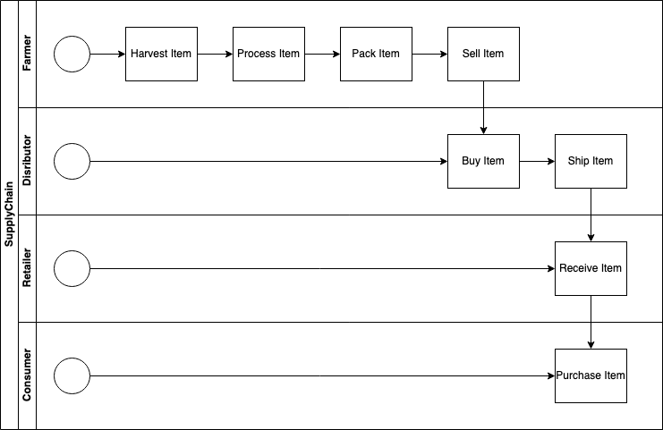
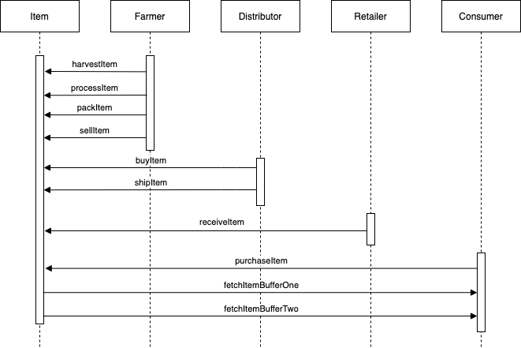
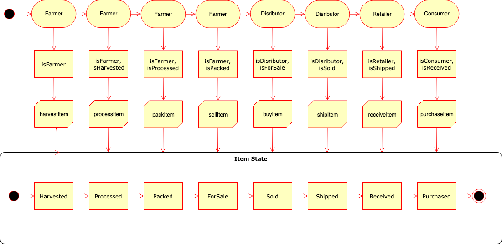
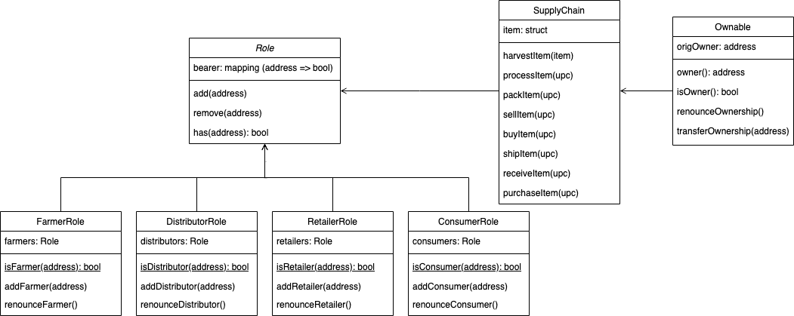
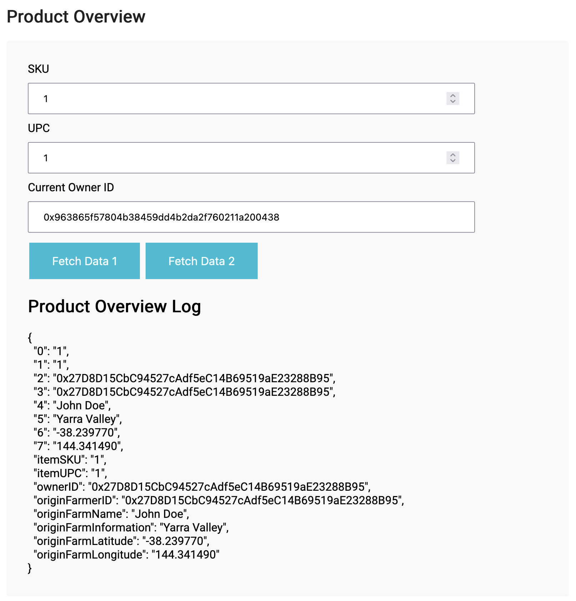
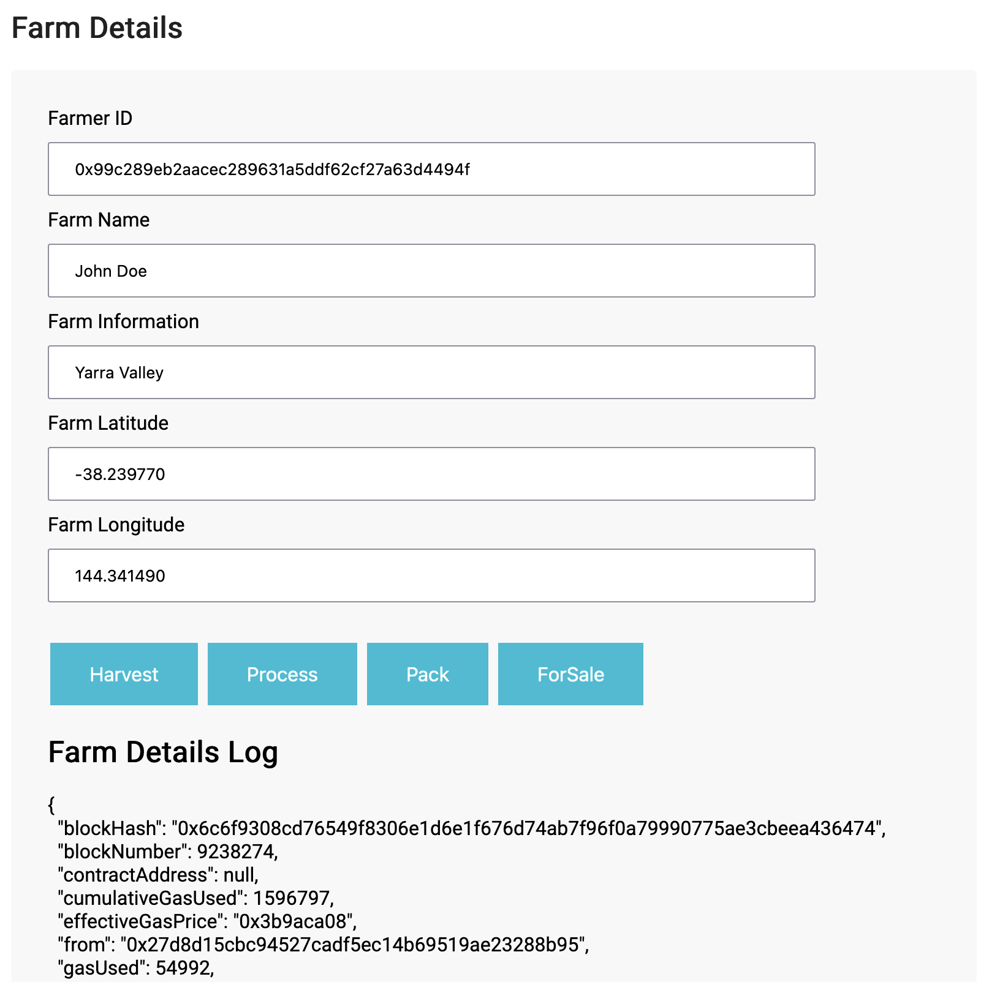
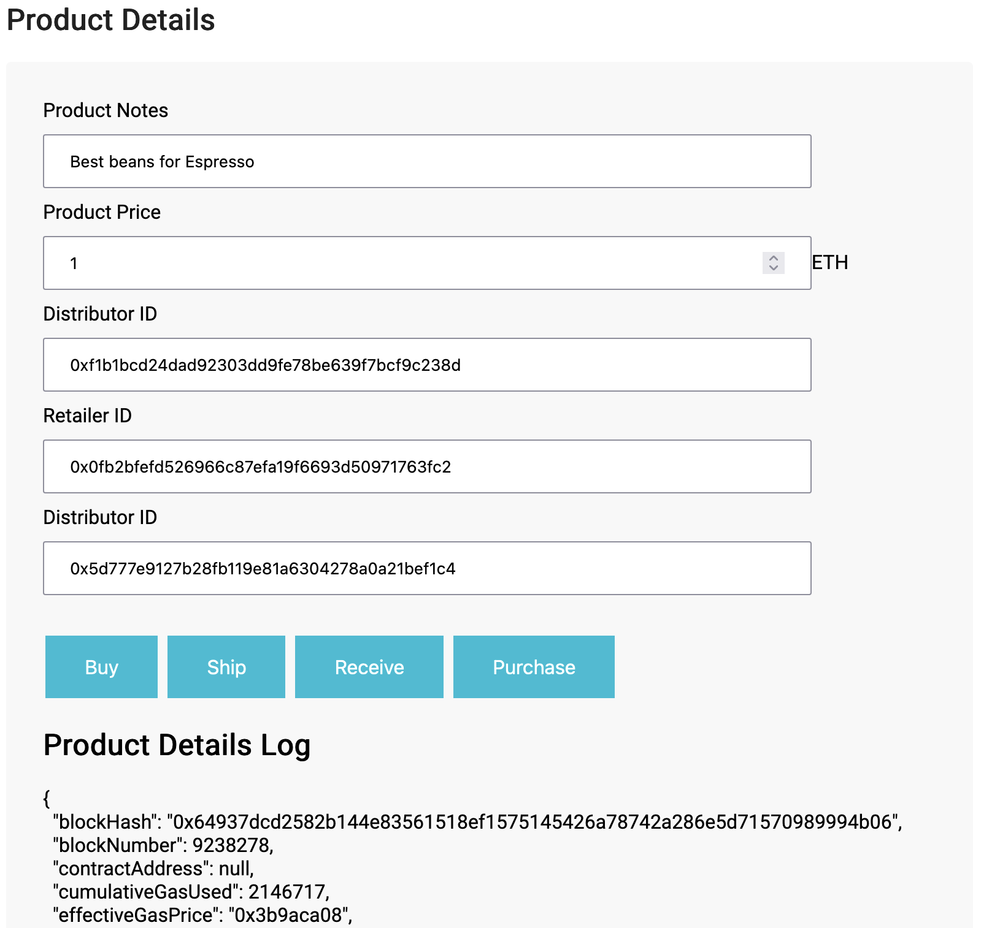
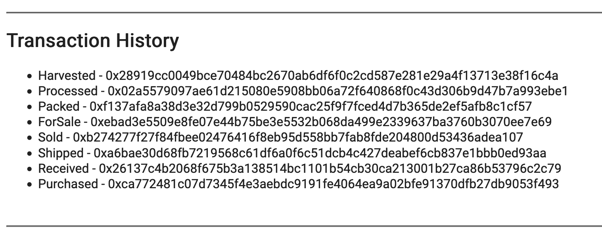

# Set up Ganachi
Refer original [README.md - Get Started section](README-default.md#getting-started) to setup Ganachi to run private blockchain in local computer.

# Smart Contract in Rinkeby testnet
The contract is deployed with address `0x27D8D15CbC94527cAdf5eC14B69519aE23288B95` in Rinkeby testnet.

The contract address is [0x5bc02ba9417180eb1fe9e4aaafe8dd185844f895](https://rinkeby.etherscan.io/address/0x5bc02ba9417180eb1fe9e4aaafe8dd185844f895#code)

The deployed log as following:

```bash
❯ truffle mirgrate --reset --network rinkeby
Using network 'rinkeby'.

Running migration: 1_initial_migration.js
  Replacing Migrations...
  ... 0xb66edbb1e395b104b8ae5cd5c7349c685be179b79114e8b24f2cdce4c934506a
  Migrations: 0x533c213c4d0585bd0a54ab017b2014681662fdaf
Saving successful migration to network...
  ... 0xd0c0f7f3edcbc797acb2512b4593d8ef3af51f81ef2f8f4fa4b04972b12820c3
Saving artifacts...
Running migration: 2_deploy_contracts.js
  Replacing FarmerRole...
  ... 0x5b52b6874d51780cff70a97dd585e353f972fafcf189c2c630fa17f08e92c6c6
  FarmerRole: 0x3608c5a15cdc71a7f98269d19c08c997a1bcc3db
  Replacing DistributorRole...
  ... 0xe0002b38cc668d157fecbeb3b2066de3c814998ceeace1c021449fae41122166
  DistributorRole: 0x25657a673935a3433b0f47627c1a09a6952058c5
  Replacing RetailerRole...
  ... 0x65ce8a07d4b92c1f9acbbc4e3fd16b28db8b0ab7435a7d7e48184c3df55de881
  RetailerRole: 0x0ab17fb5911880fb034f837e2769faefa6ae9687
  Replacing ConsumerRole...
  ... 0xfbc87c0a11e92611aab53836b05d1f3eed180dbce5d8663635e46379e8e41c4b
  ConsumerRole: 0x19d1dd8916d1da3058e35eb5bfc9fbb8ea2f47c7
  Replacing SupplyChain...
  ... 0x4b3063a7b63b750a9bb66099f659c5b37d88a86cc136d6cccf0e10aa2b51a0ce
  SupplyChain: 0x5bc02ba9417180eb1fe9e4aaafe8dd185844f895
Saving successful migration to network...
  ... 0x6edc96b139d86e4f50029f5918708f9dca0c0d150ba6eccaa24f42506bad5f5c
Saving artifacts...
```

# Libraries

## Build Smart Contract
1. `@truffle/hdwallet-provider@^1.5.0`: Used To deploy contract to Rinkeby testnet.
2. `truffle-flattener@^1.5.0`: Used to generate falttened Solidity file to upload to etherscan.

## DApp frontend

My boilerplate cannot work normally, so I rewrite the whole frontend js code.

The following libraries are used to pack js.

1. libraries to bundle frontend
    ```
    "copy-webpack-plugin": "^5.0.5",
    "webpack": "^4.41.2",
    "webpack-cli": "^3.3.10",
    "webpack-dev-server": "^3.9.0"
    ```
2. `web3@^1.2.4` is used to execute Smart Contract and connect to MetaMask wallet.
3. `jquery@^1.12.4` is used to code UI easily.

# Program versions
node: v14.17.0

tuffle: Truffle v4.1.14 (core: 4.1.14), Solidity v0.4.24 (solc-js)

web3: 1.2.4

# UML diagrams

## Activity

## Sequence


## State


## Class (Data Model)



# DApp introduction

The DApp User Interface when running should look like...










## Run frontend

Switch working directory into `project-6/app` and executing following commands to run frontend in local.

```bash
cd project-6/app
npm install
npm run dev
```

You will see the log like following:

```
❯ npm run dev

> app@1.0.0 dev /Users/brian.yeh/Code/Practices/Blockchain/nd1309-Project-6b-Example-Template/project-6/app
> webpack-dev-server

ℹ ｢wds｣: Project is running at http://localhost:8082/
ℹ ｢wds｣: webpack output is served from /
ℹ ｢wds｣: Content not from webpack is served from /Users/brian.yeh/Code/Practices/Blockchain/nd1309-Project-6b-Example-Template/project-6/app/dist
ℹ ｢wdm｣: Hash: c021bd29a17c96d88172
Version: webpack 4.46.0
Time: 1718ms
Built at: 09/05/2021 4:02:28 PM
     Asset       Size  Chunks             Chunk Names
index.html   4.84 KiB          [emitted]  
  index.js   4.36 MiB    main  [emitted]  main
 style.css  968 bytes          [emitted]  
Entrypoint main = index.js
[0] multi (webpack)-dev-server/client?http://localhost:8082 ./src/index.js 40 bytes {main} [built]
[../build/contracts/SupplyChain.json] 950 KiB {main} [built]
[./node_modules/ansi-html/index.js] 4.16 KiB {main} [built]
[./node_modules/jquery/dist/jquery.js] 287 KiB {main} [built]
[./node_modules/web3/lib/index.js] 2.06 KiB {main} [built]
[./node_modules/webpack-dev-server/client/index.js?http://localhost:8082] (webpack)-dev-server/client?http://localhost:8082 4.29 KiB {main} [built]
[./node_modules/webpack-dev-server/client/overlay.js] (webpack)-dev-server/client/overlay.js 3.51 KiB {main} [built]
[./node_modules/webpack-dev-server/client/socket.js] (webpack)-dev-server/client/socket.js 1.53 KiB {main} [built]
[./node_modules/webpack-dev-server/client/utils/createSocketUrl.js] (webpack)-dev-server/client/utils/createSocketUrl.js 2.91 KiB {main} [built]
[./node_modules/webpack-dev-server/client/utils/log.js] (webpack)-dev-server/client/utils/log.js 964 bytes {main} [built]
[./node_modules/webpack-dev-server/client/utils/reloadApp.js] (webpack)-dev-server/client/utils/reloadApp.js 1.59 KiB {main} [built]
[./node_modules/webpack-dev-server/client/utils/sendMessage.js] (webpack)-dev-server/client/utils/sendMessage.js 402 bytes {main} [built]
[./node_modules/webpack-dev-server/node_modules/strip-ansi/index.js] (webpack)-dev-server/node_modules/strip-ansi/index.js 161 bytes {main} [built]
[./node_modules/webpack/hot sync ^\.\/log$] (webpack)/hot sync nonrecursive ^\.\/log$ 170 bytes {main} [built]
[./src/index.js] 12.4 KiB {main} [built]
    + 488 hidden modules
ℹ ｢wdm｣: Compiled successfully.

```

Use browser to connect url `http://localhost:8082/` to launch frontend app.

## Transaction History on Rinkeby testnet

- Harvested - 0x28919cc0049bce70484bc2670ab6df6f0c2cd587e281e29a4f13713e38f16c4a
- Processed - 0x02a5579097ae61d215080e5908bb06a72f640868f0c43d306b9d47b7a993ebe1
- Packed - 0xf137afa8a38d3e32d799b0529590cac25f9f7fced4d7b365de2ef5afb8c1cf57
- ForSale - 0xebad3e5509e8fe07e44b75be3e5532b068da499e2339637ba3760b3070ee7e69
- Sold - 0xb274277f27f84fbee02476416f8eb95d558bb7fab8fde204800d53436adea107
- Shipped - 0xa6bae30d68fb7219568c61df6a0f6c51dcb4c427deabef6cb837e1bbb0ed93aa
- Received - 0x26137c4b2068f675b3a138514bc1101b54cb30ca213001b27ca86b53796c2c79
- Purchased - 0xca772481c07d7345f4e3aebdc9191fe4064ea9a02bfe91370dfb27db9053f493
